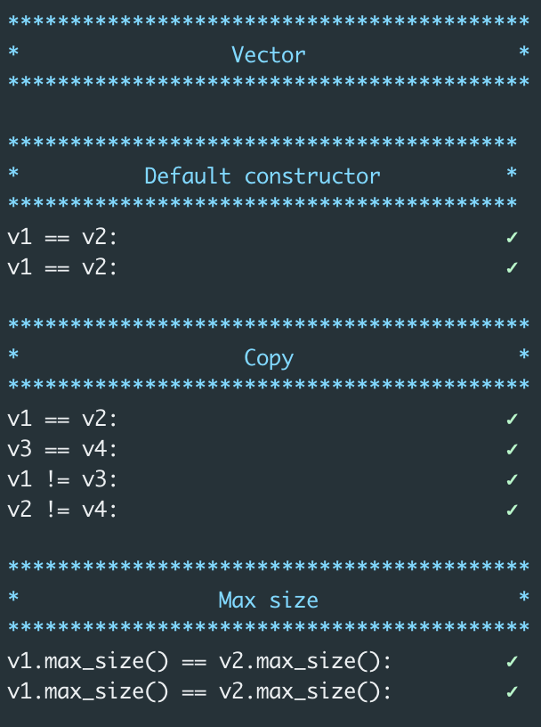

# ft_containers tester

> ⚠️ Tests are pretty basic, so make sure to test more extreme cases.

Your container is compared to the std ones. Compile on Linux, the sanitize flag will reveal leaks.



## Usage

```sh
# ls -> .. .. .. ft_containers .. ..
git clone https://github.com/t0mm4rx/ft_containers_tester
cd ft_containers_tester
# If your hpp files are not in ../ft_containers/include/, edit ./tests/tests.hpp includes
make vector
make list
make map
make queue
make stack
```

Contact tmarx on Slack if you have suggestions, or in case of errors.